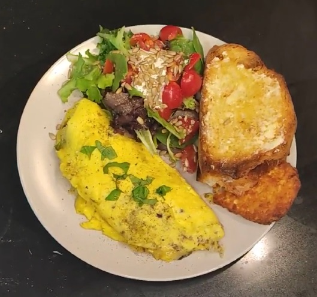

# Ode du Fromage

The weekend. A gift regular, yet sought after desperately, with its slowly
unfolding leisure and a too-fleeting break from regimen forced by the
constraints of our weekday contracts. Oh, to dance, however briefly, in the
respite. It does a soul good.

And what better expression of our dalliance allowed than the indulgence we know
as "brunch." Usually implying a weekend, brunch is synonymous with leisure. It
might look a little different right now than we remember it, the lengthy,
mimosa-soaked social events, but as humans we're forced to adapt to new
situations constantly, and so it goes with brunch, moving from the hip eateries
to the confines of our kitchens.

Often you'll find me making something a little extravagant--the kind of thing
requiring a commitment you're not usually willing to make on a weekday. Crab
cakes Benedict--whisk, whisk, whisking hollandaise over a double boiler. Fresh
biscuits and country gravy. Maybe a challah French toast.

Today, though, I very clearly had an omelette on my mind. Maybe that sounds not
very extravagant--a waste of the opportunity a weekend affords us, you might
think--but don't underestimate the power of an omelette. It's everything,
really. From quick breakfast (or lunch, or dinner) prepared hastily at home; to
modest diner staple; to dare-sized dozen-egg monstrosities served to drunken
revelers at all-night eateries; to the French delicacy, hallmark of and litmus
test for an accomplished chef, silky soft exterior, sensuous custardy texture
inside, married in the crucible of fat and heat. Bursting with lots of ornate
fillings--vegetables; meats; smoked salmon, even--or naked, adorned with just
ornamental herbs. It's great either way, and everywhere in between.

Classic and elegant, but nourishing and approachable, all at once, an omelette
is beautiful, really. I may love a little indulgence every now and again--maybe
even more than now and again--but I've spent a lot of time with omelettes,
experimenting and learning, and it's what I'll always come back home to.

Find your omelet. Respect it, savor it, and let it feed your soul.

