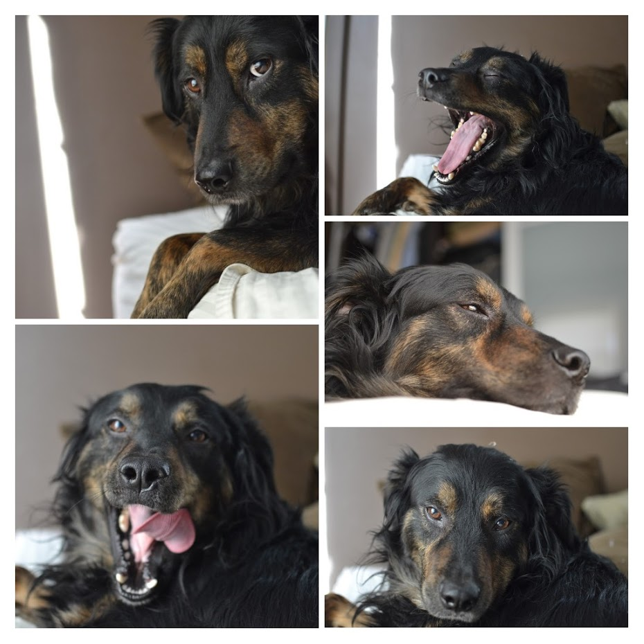

# When They Save You

It's National Pet Day today. Normally, I don't pay much mind to these "National
Whatever" days, because there's at least one every day, so it follows that only
a handful of them are going to mean anything to you. But if you have a pet, you
know.

I grew up with pets, and for nearly 20 years as an adult, I always had a pet,
or two, or three, or--well, up to six--as domestic companions. I had the best
dog, Tesla--so sweet, so beautiful--which is what you're supposed to say about
your own dog, I know, but, I really mean it. She knew everyone, and loved
everyone. I lost her a few years back, and over the next couple years I lost
both the cats I still had. And just like that, my home was empty. For the first
time in a very long time. When I talked to myself, I was really talking to
myself. I don't think it really hit me at the time, how my world changed, to
not have any furry companions. Only in retrospect did it come into focus.

I can say retrospect, though, because of a little miracle that happened last
spring. Little miracles surround us, and are largely defined as miracles by
their applicability to our own contexts, but never mind that--it's still a
little miracle because **isn't EVERYTHING**?

Last spring is when I met Juju, or should I say, when he found his way to me,
charted on his path by a map of caring friends who know well both me, and the
deep bond I had with Tesla, and were reminded of her by Juju's adoption post
photos.

I'd told myself I was going to take some time off from pets, to open a window
where I could take advantage of the lack of ties in my life to do something
different. Travel, really, is what I meant. It wouldn't be hard for me to
practice a trade from any location in the world, pretty much, and there's a lot
of world to see, and the way my life's worked out so far, there was nothing
tying me to much of anything, especially without pets. (I've since come to
think that this interpretation of "not being tied" to anything is a little
naive, but that's another topic.)

Anyway, that nomadic fantasy came to me while I was doing some extended travel
and fell in love with idea of bouncing around the world fancifully, tied to
nothing, experiencing and learning everything. It's all very romantic, the
idea. In practice it would surely be harder than it was in my mind, but never
mind that: if you focus on the practicalities of a dream, and not the dream
itself, you'll quickly talk yourself out of it.

So imagine my quandary when a dog was, basically, presented to me by
well-meaning friends who knew how deeply I cared for my last companion, and, I
presume, wanted that for me again. Okay, maybe that's not a quandary for you.
Maybe you're very different from me; maybe you would have jumped at that
instantly. But I knew that adopting a new dog would mean that I'd sort of have
to say farewell to the idea I'd carried with me for the past few years. Or at
least acknowledge that it would be many times harder to pull off, if I were
committed to it. 

But having had this good boi for nearly a year now, it doesn't pain me at all
to say that I wasn't as committed to it as I ever would be having a the love of
a wonderful dog in my life. So many people close to me encouraged me to welcome
this dog into my life, and honestly, I knew the moment I saw him how this was
all going to end--but sometimes you have to walk that path even when you know
where it's going to lead.

Even when I'm alone, I'm not alone. That's the power of a dog. Well, one of the
powers. They're truth incarnate, and that's powerful for a lot of reasons.
Every day I get to wake up and look at his little face and thank the stars for
bringing him to me. Having him around has made me little bit better person, a
little bit every day.

Hug your pets. They're fleeting but they're fucking magical.

