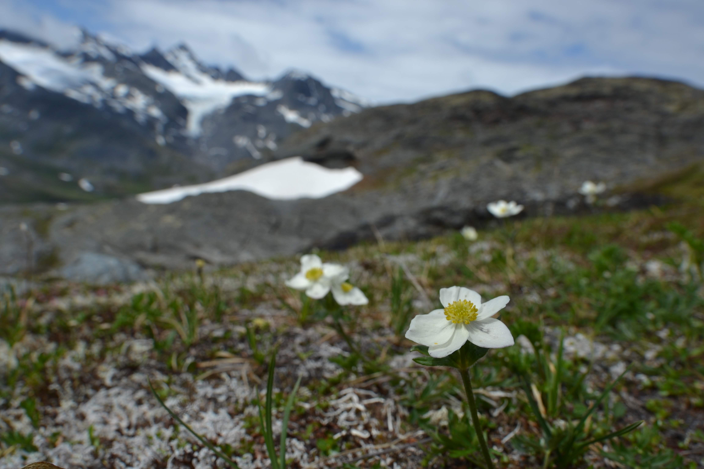

# The Garden of Your Mind

So, I'm ambitious, I think, but not in the way you're thinking. It's kind of an
unfocused ambition. Like, I love beauty and the journey of discovery, and those
things go hand in hand in so many pursuits. More than I'll ever be able to
accomplish, but that doesn't stop me from daydreaming about what it'd be like.

Daydreaming is nice, but like anything, too much of it comes at a steep cost.
The cost of actually living and collecting experiences that make you a more
faceted person than you were before. And the most faceted people are the most
beautiful people, after all.

There's so much in this literal world of possibility, though, how can we
possibly choose how to spend our time? It feels overwhelming. There's so much
that's worthwhile, constructive, and beautiful.

But life's momentum is so substantial. It rushes by in a blur, so it's
understandable why we don't stop for a minute and think about what consumes our
capacity as human beings. But to keep growing, we need to garden our minds.
There's not enough room for all the things we've collected inside. We might've
planted a lot of it at a time when it made sense, and then just let it take
root, sort of passively assuming it's all important, when a lot of it is really
just relics from a bygone era, no longer something we feel strongly about.
Ideas, beliefs, goals, sometimes even people in our lives. If you just let the
chaff stick around, you'll never have space for what's actually important to
you now. You might not even realize what's important to you without enough
space. So, yeah, clear space.

It's not that easy, though. We're humans, and as humans, we're not only
overstimulated--especially in this attention economy--we're sentimental.
There's a place for sentimentality, but learning to use it sparingly will serve
us well. I say this as someone who's still learning how to do this, and has a
long way to go, and probably always will. There's a person I need to become, to
be what I know is my best self, or at least my better self, and to be my best
for the people who are important to me, to bring them closer and serve them
better. 

There's so much I need to let go of to get there, I'll surely spend the rest of
my life walking this path. And I've learned that I'll need lots of help along
the way, something I wish I'd learned and accepted a long time ago. But I'm
here now, in this moment, and I'm learning the way forward. If you see me
straying, can you please remind me?

