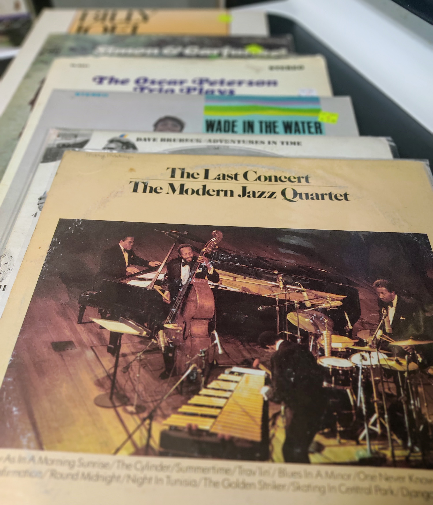

# Ponder the Album Art

Tomorrow I'm going to pick up a record player, from a generous friend who has
an "extra" one. I'm kind of excited. I grew up with records. They were what I
had as a kid. I used to save up to buy 45s--or "little records" as my brother
and I called them--and put those stupid little adapters in their comically
large center holes and play them on my all-in-one record player. I must've worn
a hole through my copy of "Safety Dance." I played Taco's "Puttin' on the Ritz"
so many times, each time mimicking that tap dance solo in my bedroom, surely to
the chagrin of my poor mother downstairs, though she was the kind of beautiful
person who would've loved it through the din, because of the joy she would've
felt in her child expressing himself.

It's been more than a few years, but I clearly remember the feeling of pulling
an album out of its sleeve, in its protective sheath, carefully removing the
record, being sure to only touch the edges, maybe spinning it artfully, braced
between the fingers of your two hands, as you moved to place it on the spindle.
Gently place the needle. Sit back and fall into the album art; the liner notes;
read the lyrics, if it was the sort of album that had them.

Soon enough the era of tapes was upon us, and then CDs, and, then ultimately,
mediumless digital music in "the cloud." Each one sort of lost some of the
album experience; an experience I didn't really appreciate at the time because
it was all there was, but one that seems more poignant through the lens of
retrospect.

Such is the nature of nostalgia, though, powerful opiate that it is. It soothes
us with its sensation that things were simpler then, and, by extension, better.
It's not necessarily true, but the passage of time blurs everything with its
paintbrush, and life is enough of an illusion anyway that there's no reason to
not take it as truth.

