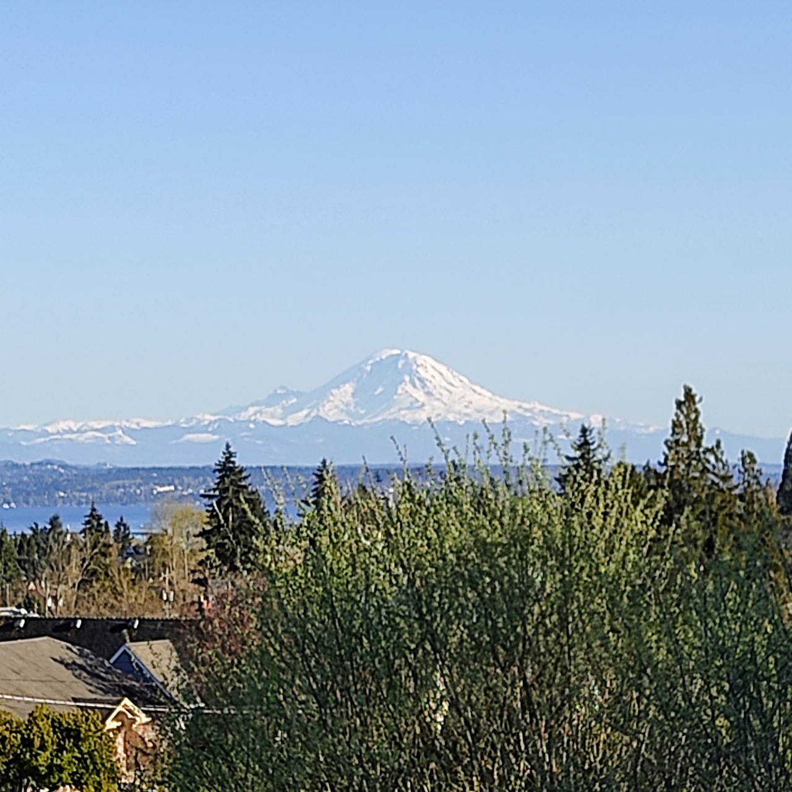

# When The Mountain is Out

The weather in Seattle has been pretty aces lately--unseasonably nice for spring, even. And when the weather's nice, The Mountain comes out. The Mountain, you may have guessed, is Mt. Rainier. And when The Mountain is Out, it doesn't just mean that The Mountain is visible. When the weather is warm, it carries a gravity that supersedes Rainier, majestic as she may be.

See, the weather isn't really all that bad here, generally speaking. I know the area has that mythos, and my telling you that it's a mythos will certainly furrow some brows, by those who think the area's grown too much. But it doesn't get that cold, and it doesn't get that hot. But the winters are dark and some days are dismal, and you're never quite sure what you're going to get. The forecasts are taken with a grain of salt, especially anything more than a few days out. Collectively, we're all gambling, our psyches on the line, waiting for the payoff. There are some who say they prefer the moody, rainy weather--and it has its place--but whatever, don't listen to them: my soul needs the sun and warmth. I want to sit on my front porch and enjoy the morning light, or go to the park and feel the evening breeze while watching a gorgeous sunset.

So when The Mountain is Out, it's a symbol of fleeting abundance, and a sign to embrace the moment, or feel the regret of letting it slip by. It's latent permission. "I'm leaving work early--the mountain's out!" "I should vacuum, but I can do that later--the mountain's out and I'm going to the park."

In this world that demands we balance responsibilities and opportunities, get to know your mountain, and when it's out. If you hesitate, it might disappear.

