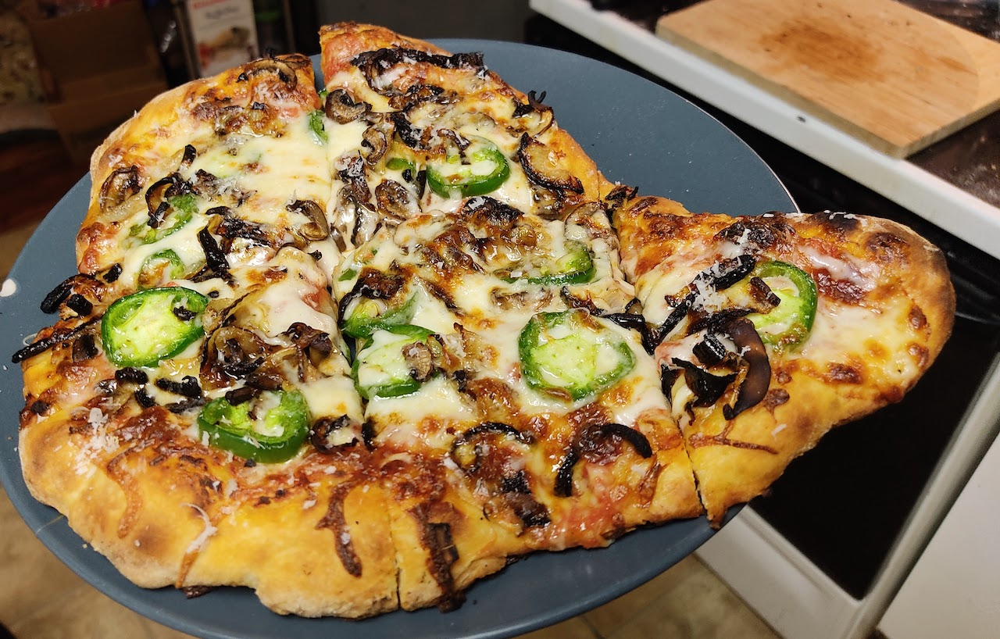

# Practice Doesn't Make Perfect

"Practice makes perfect," they say. If you keep doing something over and over,
you'll get so good so as to be infallible, would be the logical conclusion we
can draw from the pithy saying. It is, of course, just a pithy saying; a
well-meaning lie. Perfect doesn't exist. And if you do something over and over
again, you're going to have a dud every so often. The duds are okay, though:
this is our opportunity to learn and adjust for the next time.

For example, I like to make pizza from scratch. I do it fairly often. I've
gotten at least okay at it. But last time, I messed up the dough on the peel
and it stuck on the release and made a fugly pizza. An "augmented blob," I
called it, oddly shaped and too thick since the dough had bunched up. It wasn't
my best pizza, but it was still good, and I still appreciated that I had put
the conscious effort toward making something with my own hands. And maybe I
even took away yet another reminder to be a little more careful next time.

I often say that everything is just practice for the next time. That includes
the times when you're doing it "for real," because that's really just practice
with maybe some more immediate short-term consequences. The arc of practice
remains, though. You could even say that each day is really just practice for
the next. I don't know if I really get better each day, but if I think I'm
practicing, then there's a decent chance that I'm improving in some sense, even
if I can't perceive it clearly.

To be human is to be flawed. But to be human is to be able to appreciate those
flaws and see them as chances to be less flawed. It's a path that will never
end.

Practice doesn't make perfect. Practice makes better.

