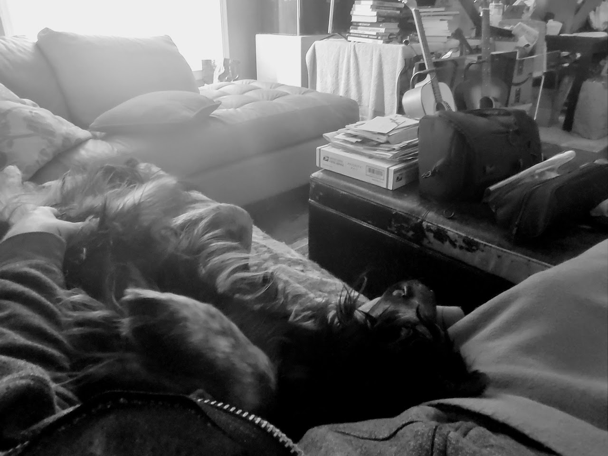

# Extemporaneous Coercion, For Your Own Good

I've been feeling a little awash lately--haven't we all--tossed around by the
circumstances I've created, and also those that have found their way to me, one
way or another. My day starts out hopeful, but by the end I'm often in my head
about the things I've been neglecting, or the fragile nature of my hopes for my
future, or any number of other things, really. It's not uncommon. We're all
struggling with something, sometimes quietly, sometimes not.

To make things worse, I do a pretty poor job of taking care of myself in a lot
of regards. I can get overwhelmed kind of easily. One of the saving graces in
my life have been my dogs. If you haven't lived with a dog, then you probably
don't understand, and people who gush about dogs sound like they're in a cult.
But if you have known and loved dogs, then, well, you know. And today my dog
saved me in one of the little ways that he does.

He enjoys being out on the front porch, not far from my desk where I spend a
lot of my day. It was late, too late for him to be playing with the squeaker he
was chewing on outside, and I called him in. He hopped up on the couch and let
out a heavy sigh, a gratifying sound to me, having walked with him for several
hours earlier in the evening. I sat down next to him, intending just to pet him
for a moment before getting back up and starting preparations for bed. And he
did something he often does: he put his head on my lap. But there was something
poetic about it this time.

Anyone who keeps a pet knows that there's no moving when a pet is lying on you
in any capacity. Anyone humane, anyway. And Juju had caught me without my
phone, or access to any electronics. No phone, no computers, no TV on. Just
some quiet music, his head on my lap, and his deep breathing, that kind of
tired and really relaxing breathing. I don't know that he knew what he was
doing--who's to say, really--but he forced me into an impromptu self-care
session.

Without the usual barrage of self-imposed distraction, I embraced the
extemporaneous therapy of it all, running my fingers through his long coat,
massaging his neck and scratching behind his ears. Tactilely aware of how I was
soothing him, and conscious of my own breath, it slowed and deepened as I felt
the stress begin to peel away. My pulse dropped. Five minutes, ten minutes, a
half hour. A serenity washed over me, a serenity too long absent, yet only ever
moments away if you can tear yourself away from yourself and let it take you
over. It's so simple, but so elusive. So we sat there for a while, caring for
each other, restoring one another.

Nothing really changed during this time about the world that had agitated me.
The things that had wound me up still existed. The things I'd neglected or
avoided remained in need of attention. But I was reminded that the power to
change our perception is always close at hand. It's not always obvious, and
it's often not easy, but it's always there, inside us. 

Remember your agency. Count your blessings. And breathe.

