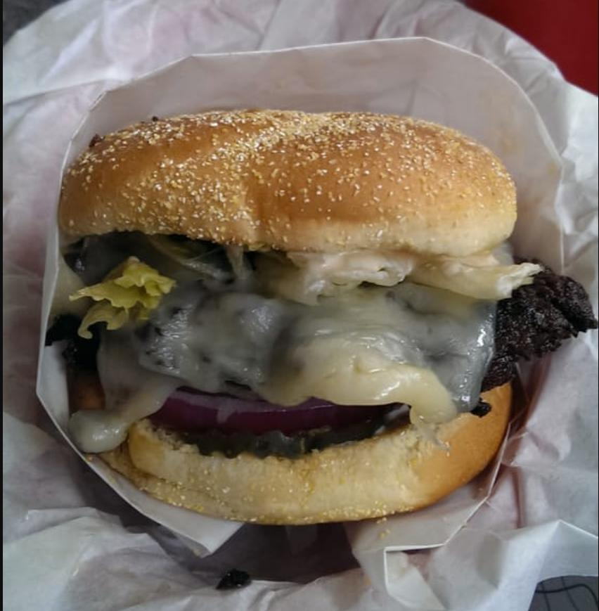

# Getting Back To It

Yesterday I had a Zippy's burger. Let me back up. Zippy's is a well-regarded
local burger spot. I can't comment on the regular burgers, but their house-made
black bean burger is delicious. I like the #11, which has Mama Lil's Hot
Peppers, smoked cheddar cheese, and pepper jack. Their fries have a nice
potatoey flavor that you don't get in a lot of fries. And they make a mean
chocolate shake. The kind that you can't stop drinking when you're pulling on
the straw, but know you should or else it's going to be gone much sooner than
you'd like. But you don't stop, and then it's gone, and you're sad about that,
but so glad for it having happened at all.

_"I don't care, Ian! Why are you telling me this?"_

I know, I know, but hang on. What I eat there isn't as important right now as
how long it'd been since I'd been there. I don't think I'd had a Zippy's burger
in at least a year and a half. That's not notable on its own--there are plenty
of places I consider "favorite spots" that I don't visit for a year or more at
a time. What makes it notable is what the world has gone through between then
and now. We've lost touch with those little facets of our lives--like a
favorite burger--that describe our fancy and our interactions with our
surroundings. We've gone through a planet-scale denial of service for our
whimsy.

That's changing, though. We're beginning to see the light again. We're
emerging, slowly, carefully, from our holes, squinting at the sun, and
venturing forth. It may be a gradual and sometimes awkward process, but we're
starting to reconnect with the things that made us who we are. 

Yesterday's burger was a delicious serving of catharsis. There's a world of it
waiting for us on the far shore, and we're getting close.

