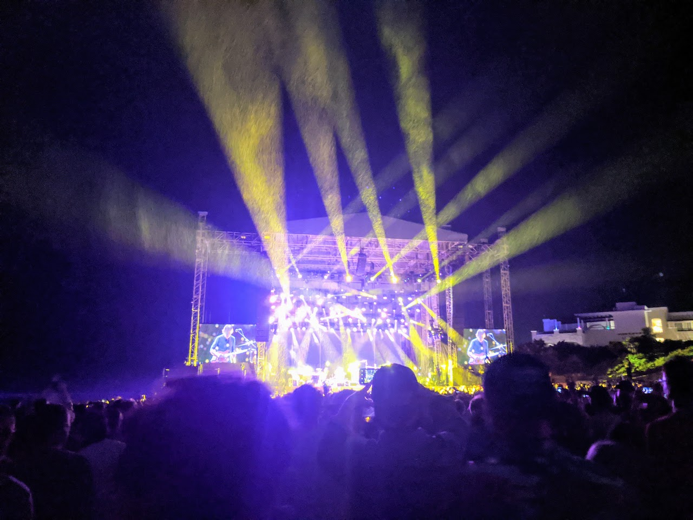

# The Spirit of Radio

A little over a year ago, I'd just returned from a week in Mexico, enjoying the
sun and seeing my favorite band Phish with some close friends. We didn't know
that we were about to enter a time of pandemic and have our worlds turned
upside down.

In those early days, it was really really easy feel like you were drifting,
like everything you'd known had been torn away from you. The uncertainty of
what each day and the coming months held was enough to overwhelm you. It was
important to find a tether back to something reliable, something you could
count on being there at any hour. Something you could turn to when everything
else just seemed like too much.

For me, this came in the form of a Phish-focused internet radio station called
JEMP Radio. I'd heard of it before, but hadn't really checked it out. I don't
even remember the reason I tuned in for the first time, but it doesn't matter
now, after over a year and thousands of hours listened.

We gravitate to the familiar and the comfortable in times of trouble, and
surely, the station's focus was what brought me in. But what I wasn't counting
on was the humanity of it all. This is a station with heart. It was exactly
what I needed in those uncertain times--and what I continue to enjoy today,
even having gained whatever degree of comfort with the global crisis that has
been playing out since early last year.

You might hear "internet radio," and think of a mostly automated streaming
service, maybe with occasional interjections by a robot DJ voice. And you'd be
right a lot of the time. I can think of at least one right now. And there's
nothing wrong with that, but it doesn't even begin to describe JEMP Radio.

JEMP embodies everything you loved about old school radio; it just brings it
into a modern era. It's brimming with the personality of the people who make it
happen. The folks who run the station and hosts of the various weekly shows
really poke through the megabits and it's very clear that you are consuming
something made with love by actual people. Race, Andy (both of them), Russ,
Mike (both of them), Julia, Alex, Slater, Ari--I feel like I kind of know them
all. And in the connected world we live in, Twitterfied and all that, I feel
like some of them know me a little.

JEMP is community. It's provided for free to the whole world, and in turn the
community who loves it recognizes how valuable it is, and protects it--with
their donations--to ensure it remains available forever. Lists of familiar
names of patrons are read in thanks week after week. You don't gain that sort
of loyalty without putting your heart into something.

We are, I hope, nearing the end of this pandemic chapter. We'll all be happy
and so, so relieved to put it behind us, to be looked upon through the lens of
history and disbelief that this actually happened. But I will of course
continue to keep JEMP a part of my life. It helped me through darkness, and
gained my trust, and my thanks. It makes my days just a little bit better, not
just for the music, but as a reminder that in an age of automation and
increasing efficiency, that there's still a space for personality, care, and a
human touch.

