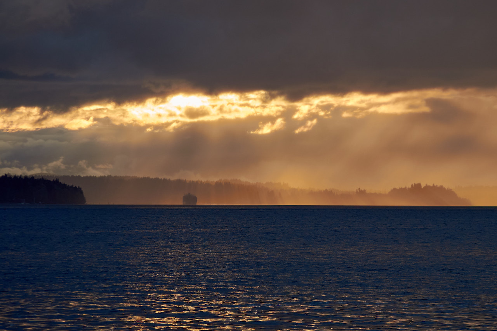

# Daily Closure

There's nothing like a sunset. I love them. I mean, who doesn't? Have you
actually ever met anyone who is anti-sunset? It'd be ridiculous. So, fine, we
all like sunsets, so nothing I'm going to say is going to be novel--it never
is, anyway--but you've made it this far, so just keep going.

I love sunsets, but don't get me wrong: I love a good sunrise, too. I just
don't keep the hours to be able to see them that much. If I'm seeing a sunrise,
there's a good chance it's because I've been up long enough to see it get dark
and then get light again. That often means it's been a great night, having
gotten so lost in exploration that time melts away, until it slaps me in the
face with the return of daylight and the conscious realization of the time
that's passed. Lots of people love sunrises. Not just because they're pretty,
but because they're full of promise. A new day. A fresh start. It makes sense.

A sunset doesn't carry that same promise, but it offers its own message. It's a
little bit of closure, and you can count on it every day. That's a relief in a
world that doesn't seem to let up on the accelerator. Maybe you didn't get done
what you wanted to today. "Hey, it's okay, stop worrying about it for now; you
can try again tomorrow," the sunset says. Or maybe you did get done what you
wanted today. "Congratulations! Rest easy and relax, knowing you won the day,"
it says, in this case. Either way, it's a comfort, and often a beautiful one.

And just like life, we can count on it happening, but we can't be sure exactly
how it'll happen. Will the sky ignite into explosive color? Will a band of dark
clouds "squeeze" the remaining light into a brilliant, narrow stripe across the
horizon? Will a perfectly clear sky allow the mountains to be silhouetted and
outlined with a flaming ribbon of orange, before they all fade into darkness? 

We can't know until it happens. It's a combination of luck and placement. Just
like everything else.

