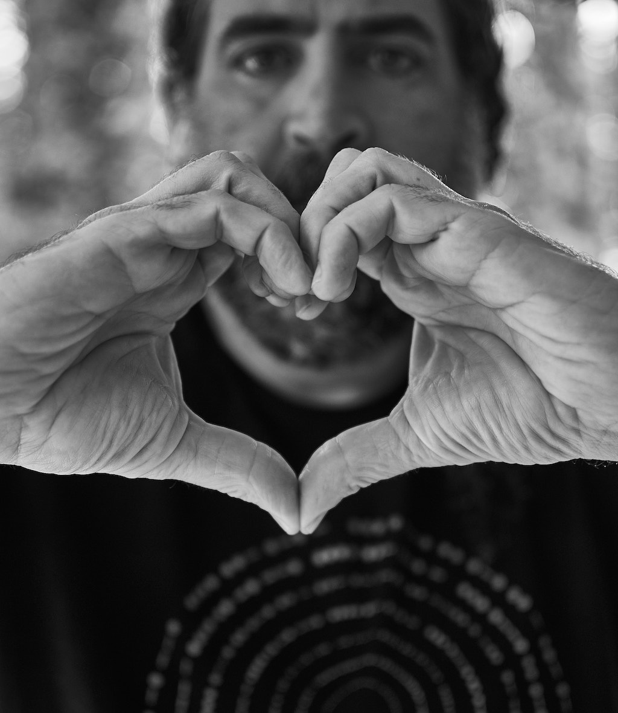

# Choose Love

I've been writing regularly lately, and when you do something regularly, you
begin to see patterns emerge, and there's no exception here. I guess it's no
real surprise to me, but it's become very clear that I write a lot about our
"humanity" and the hopes and fears and aspirations and setbacks it implies.
It's clearly a projection of my own mind, as these are the things that swirl
around in it all the time, in quiet morning moments; while doing the dishes;
while waiting for the kettle to boil water; while folding laundry. 

I have the space in my life to contemplate these things, or be haunted by them,
depending on how you slice it. More so than I have in the past, because as time
passes, I'm feeling more and more human. As you gain experience, time moves
faster, but life's film sort of slows down, and you can more easily pick out
details. You can see through the sheen and see things for what they really are.
You see your own frailty and struggles and fears, and feel them more deeply.
And likewise, you see all this in everyone else much more readily, too. It
starts becoming clear that we're unified in the unknown.

And thus I spend a lot of time thinking about this, and contemplating the
places I want to take myself in the time I have. I talk about the ways I think
I might be able to get there, and the way those things make me feel. I've said
a number of things in a number of different ways, but I think it all comes down
to something very, very simple.

**Chose love. Always choose love.** Every time. Love is the only true thing.
Love will never lead you the wrong way.

**Choose love for yourself.** Choosing love for yourself means being honest and
true with yourself, and expressing your depth through your words and your
actions. It means overpowering the fear that your fragile ego has instilled in
you, afraid of the consequences of being your full self, and letting out what's
inside you. Your ego would keep you hidden, to "protect" yourself, but nothing
you can gain by protecting yourself could ever equal the depth you gain by
being true and surrendering to the love inside you.

**Choose love for others.** Everyone is struggling. Everyone is afraid of
something. Give others the grace you wish you could give yourself. The
profundity with which you can affect someone simply by showing them love,
instead of derision, jealousy, suspicion, or anger cannot be expressed in mere
words. Be honest with others, to help them understand you, and they will in
turn show you the love that you have given them. Love for others is love for
yourself.

**Choose love even though it won't be easy.** Love doesn't always mean
happiness--that's the realm of Hollywood and harlequin romances, not the one we
actually live in. Love bites back. Love will hurt you. It's not a question of
if, but when. But when you choose love, you'll know you've done the right
thing. For yourself. For others. For the light inside all of us.

In a world that doesn't flinch whether it lifts you up or crushes you, a world
where it's easy to get lost, love is a north star to guide you. Choose love and
you will never be lost. Choose love, and what you give will amplify itself
tenfold and you will recognize it when it visits you again and embraces you.

I am tired. I am feeble. I am scared. But I am choosing love, and so should
you.

